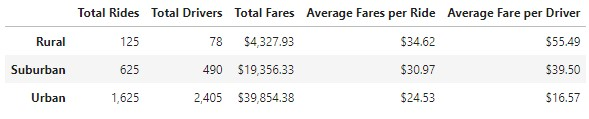

# PyBer_Analysis

## Overview of the Prject
Using Python and Pandas, I created a summary DataFrame of the ride-sharing data by city type. I then created a multiple-line graph to visualize the total weekly fares for each city type using Pandas and Matplotlib. 

## Purpose
Creating visualizations of rideshare data for PyBer to help improve access to ride-sharing services and determine affordability for underserved neighborhoods.

## Results
### Ridesharing Summary DataFrame by City Type

### Multiple-line Chart of Total Fares for each City Type

### Differences in Ride-sharing Data Among the City Types
- As we might have predicted, urban cities with their larger populations have the largest number of total rides--with 2.5 times the total rides in suburban cities and 13 times the total rides in Rural cities! It follows then that urban cities also have the largest number of total drivers and bring in the greatest total fares between the three city types.  
- While urban cities may be at the top of the ranks for three out of the five categories we analyzed,  their average fares per rider and average fares per driver rank the lowest.  Urban drivers are making about three times less than their Rural counterparts with an average fare per driver of $16.57 for Urban drivers and $55.49 for Rural drivers.  
- Urban cities seem to have a surplus of drivers.  We can see that there were 1,625 total rides with 2,405 total drivers in urban cities. That leaves 780 drivers out of work during the time frame of this data set. 
- In rural cities, the average fare per ride is only about $10 more than in their urban neighbors.  However, due to a supply of drivers that is about half the demand for rides, the average fare per driver becomes significantly higher for rural drivers.
- Suburban cities seem to sit somewhat in the middle of their urban and rural counterparts for all of the categories we analyzed. 
- Looking at our multiple-line chart, we see similar peaks and dips in total fares across all three city types. Though there are a couple time frames where their total fares seem to move opposite of one another.  Around the first week in January, suburban and urban total fares seem to increase while rural total fares decrease. We see peaks in total fares for all city types in the last third of the month of February that is followed by a dramatic decrease in total fares across city types. 

## Summary
There are clear and significant differences in the ridesharing data across urban, suburban and rural cities in the categories of total rides, total drivers, total fares, average fares per ride, and average fares per driver.

### Business Recommendations
Based on my analysis of the Pyber ridesharing data, I would make the following recommendations to the CEO for addressing any disparities  found among the city types:

1. One of the first things I would suggest to Pyber is to address the surplus of drivers in urban cities. They might develop a way to communicate to urban drivers that there are riders in need of a driver in a nearby rural or suburban area. Show the driver the potential fare they might make by picking up a rider in a neighboring city.  Thus the driver will have an incentive to move across city types to meet the demand of riders.  Thus generating more fares for the driver who may  not have picked up any rides or a lesser fared ride had they remained in their urban city.

2. Increase fares during peak times across all city types.  When the demand for drivers is high and the number of available drivers is low, we need to incentivise drivers to meet the demand by increasing the rates per fare at that time and in that area.  

3. It's hard to draw any specific conclusions accross time and city type on total fares alone. The parallel peaks we saw in early January for urban and suburban cities while rural cities decreased at an opposing rate might be explained by people tending to take vacation time for the New Year's holiday and it is a slower season for business in rural areas.  Rural inhabitants may travel to more populated areas during this time. But we cannot say for sure. There is a universally parallel peak for all three city types in late Februray that may be explained by people in all city types traveling more for the President's day holiday weekend? Again, it's difficult to make any significant conclusions on this data alone. In future analyses, we might reach better conclusions from a graph of average fares by city type.  One thing is clear however, demand for rides in all cities is high at that late February point and the CEO might consider increasing rates and or incentives to contract more drivers across  all city types to meet the demand and maximize total fares accross the board.  

4. Overall, conducting more research on the company data to gain more accurate real time insights into the supply and demand of the ridesharing market and then building a program that matches riders and drivers with fares that incentivise drivers based on the demand of the rider will create growth for PyBer's total fares across all city types.
